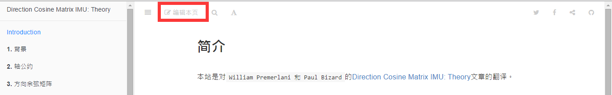
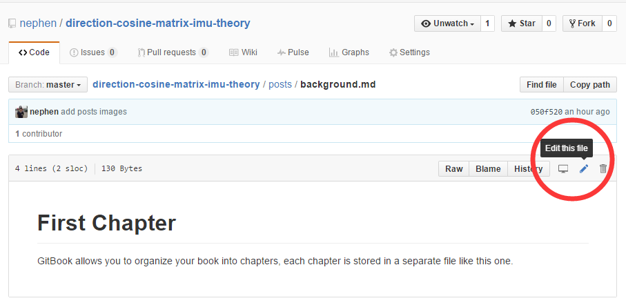
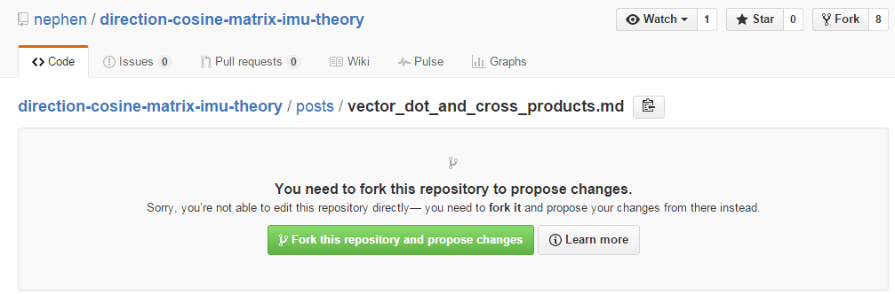
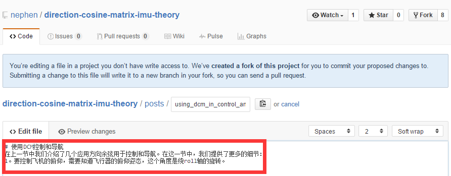
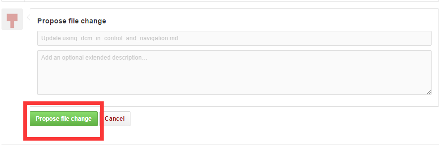
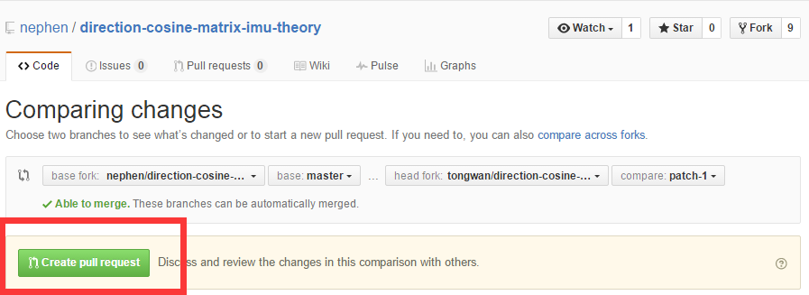
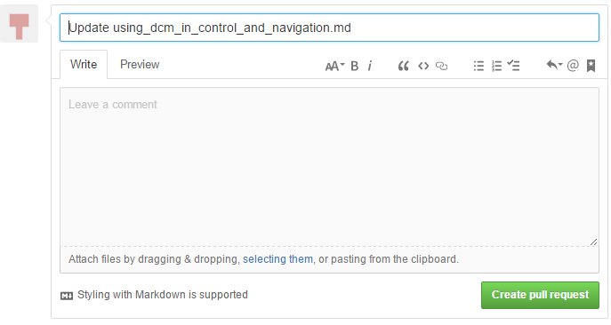
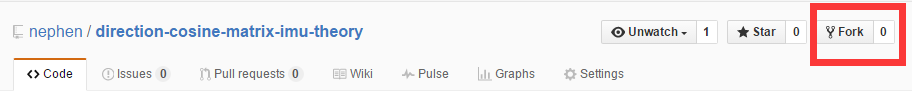
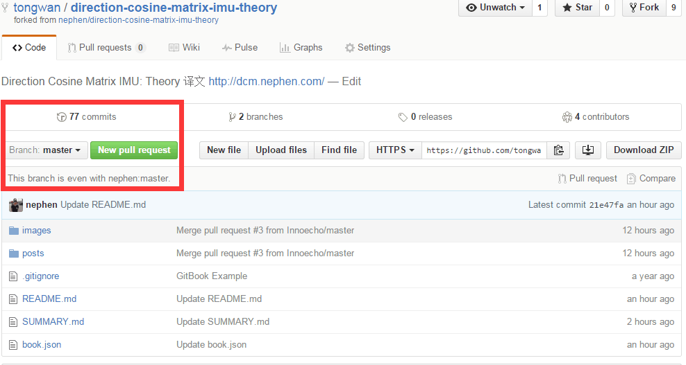

# 简介

本站是对`William Premerlani 和 Paul Bizard`的[Direction Cosine Matrix IMU: Theory](http://api.ning.com/files/BhCgAMpEVgsY6Ag26S3qH9M-vAfI5HDYJWywCrNw5DC5iVUJ8EZMlcymLZ-6A6EaRCl82BVEl-7lwLa8E-z8QedqzNfL-ji1/DCMDraft2.pdf)文章的翻译。

>访问地址：[dcm.nephen.cn](http://dcm.nephen.cn/)
  
#### 文章用处

ArduPilot的[DCM库算法](https://github.com/ArduPilot/ardupilot/blob/master/libraries/AP_AHRS/AP_AHRS_DCM.cpp#L269)实现参考文章。

#### 译文下载
该翻译文章会生成pdf文档，请转至[下载地址](https://www.gitbook.com/download/pdf/book/nephen/direction-cosine-matrix-imu-theory)。
  
#### 编辑语法
  [Markdown](http://wowubuntu.com/markdown/)语法，数学公式采用[MathJax1](http://iori.sinaapp.com/17.html/comment-page-1?replytocom=2)/[MathJax2](http://mlworks.cn/posts/introduction-to-mathjax-and-latex-expression/)。
  
#### 翻译进度

- 2016.5.8 开始翻译
- 2016.6.8 预计初版完成

#### 参与维护

1. **网页端编辑**（推荐方法：非常简单，只需三步就可以完成你的贡献）

    - 找到入口：浏览在线页面时编辑本页，这样，看到不妥的地方可以立马修改，如下图

	    

	    或者也可以打开[网页端](https://github.com/nephen/direction-cosine-matrix-imu-theory)进入要进行编辑的文件，如下图

	    ，

    - 开始编辑：进入编辑页面后，对文件进行修改，会出现如下图问题

		

		按照提示，点击`Fork this repository and propose chanes`，进入即可编辑，如下图

		
    - 提交贡献：首先提名文件更改，如下图

    	 

    	检查是否与原有版本有冲突，如果有，解决冲突再提交，没有则提交，如下图

    	

    	

    	剩下来就是版主的事了，如果没有太大的问题，版主就可以合并分支了，到这你的对本文档的贡献就完成了。

2. 本地编辑（git高级用户推荐）

	相对于网页端编辑，本地编辑只是编辑在本地，后期的提交分支还是得在网页端进行，不过在此之前你得fork本项目到你的仓库。

	

	然后进行如下操作
	
	```sh
	#下载你的项目到本地
	git clone https://github.com/your_github_username/direction-cosine-matrix-imu-theory.git

	#进入文件夹进行编辑即可，完成后如下操作

	git add .
	#这里可以看到你的更改状况

	git status
	#添加你的更改备注，让别人知道你干了什么

	git commit -m "your comment"
	#提交更改

	git pull https://github.com/nephen/direction-cosine-matrix-imu-theory.git master
	#检查是否与nephen云端产生冲突，如果有，解决冲突后重新git commit -m "your comment"

	git push origin master
	#推送到个人云端
	```
	到这里为止，还只对你自己的仓库进行了修改，你需要`new pull request`提交分支到nephen的仓库，如下图，可以看出，如果只是少量的更改，建议使用网页端编辑。

	
    
#### 参考资料

1. 关于gitbook，可查看[www.gitbook.com](https://www.gitbook.com)。

2. gitbook的官方使用，可查看[https://help.gitbook.com](https://help.gitbook.com/)。


#### License
采用[CC BY 4.0协议](https://creativecommons.org/licenses/by/4.0/)进行许可发布。

>最后感谢Innoecho、小羊、小飞、小段、一字并肩王、大牛、小孟、luoshi006、落落的主导翻译！
