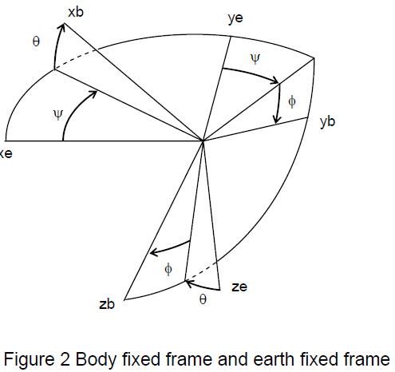
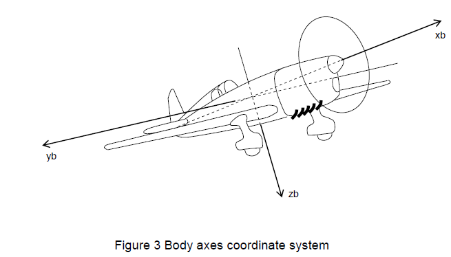

# 轴公约

为了描述飞行器的运动，需要定义一个合适的坐标系统。对于大多数处理飞机运动的问题，采用了双坐标系。一种是基于地面的坐标系统，其目的是为了分析飞行器运动而建立的惯性系统。另一种是基于飞行器本身的，称为机体坐标系统。Figure 2显示的是这两种右手坐标系统。

飞机的方向经常被描述为三个连续的旋转，其顺序是很重要的。该旋转角被称为欧拉角。机体坐标系相对于地理坐标系的方位可以通过接下来的操作确定。想象一下飞机的位置，使机体坐标系与固定机架平行，然后做以下旋转：
1. 绕zb轴旋转机体得到偏航角\\(\psi\\)
2. 绕yb轴旋转机体得到俯仰角\\(\theta\\)
3. 绕xb轴旋转机体得到横滚角\\(\Phi\\)

