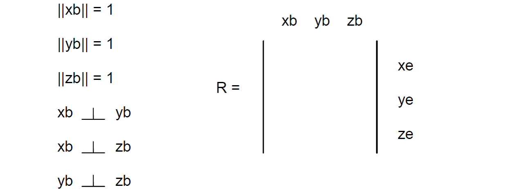

这是对应用了惯性测量单元（IMU）的模型飞机以及直升机的基于方向余弦矩阵（DCM）的理论与实现的系列文章的第一篇。事实上，这篇文章到目前还只是一个草案，依然还有很多工作要做。许多评论者对于本篇文章的增补和修改提出了很棒的建议，尤其是Louis LeGrand和匿名者，我们应该制作并准备一些文章中还没有包含的图表。我们后面会采纳他们的建议，但是这可能还需要花上很长一段时间。在此期间，我们认为我们迄今得到的成果依旧能令很多读者受益。

DCM的动机是将一个带有升降舵和方向舵控制的内在稳定的飞机在稳定和控制功能上更进一步，使一个带有副翼和升降舵的特技飞机得到稳定控制。本文的其中一个作者（Premerlan）几年前制作了一个两轴板，并为一个温柔的淑女滑翔机制定了初步的固件来提供稳定性以及返航功能。固件运行的已经足够好了，作者渐渐的信任返航功能了，但是这个功能似乎总不像作者想要的那么好。尤其是下面两个问题始终找不到满意的解决方案：

- 混合控制。意识到当飞机倾斜转弯的时候，由倾斜角产生了两个问题。第一，由于倾斜，飞机转弯时的偏航旋转对陀螺仪的偏航产生了一个干扰信号。第二，为了完成一个水平的转动，升降舵需要需要一些向上偏量。偏转的大小取决于倾角的大小，这个不能直接测量得到。这两个问题好比一个硬币的两面。
- 加速度：加速度计测量的是重力加速度与实际加速度相减所得到的差值。加速度的值等于作用在飞机上总的气动力（升力，推力，阻力等）加上重力的和再除以飞机的质量最后计算所得到的结果。因此，加速度测量的是作用在飞机上的总的空气动力的负值。重力的测量值是在使飞机水平的过程中所需要的，但这不是在加速运动中从从加速度计中获取的值。加速度是一个混杂变量。特别是当飞机上升或者下降的时候，在很短的一段时间内，加速度计的输出没有改变，但是飞机实际上加速了。美国国家航空和航天管理局的宇航员在教练机上也遇到过类似的情况。弹道路径可以产生零净力，因此能够暂时地欺骗加速度计。
将这个问题同前一个结合起来可以防止小角度的俯仰控制，这个问题避免了我们在手动启动飞机的时候使用俯仰自稳。

意识到这个问题出现的部分原因是我们目前的飞控板不具有六个自由度的惯性测量单元（IMU），因此决定重新设计一个新的，于是乎便有了来自SparkFun的无人机开发板。

***

一般使用平动（重心的移动）和转动（围绕重心的朝向改变）来描述飞机的运动。定义飞机水平放置，机头指向规定方向为飞机的基准朝向，从基准朝向开始，绕特定轴转动飞机，将其转动到实际朝向。依照此方法，飞机的任意朝向都可以用从基准朝向的转动来描述。

旋转群是由所有可能旋转的集合以及定义在其上的复合操作构成的群。它之所以构成群是因为集合中的任意两个旋转复合而成的旋转仍属于这个集合，每个旋转都存在逆旋转，并且存在单位旋转，这是旋转群的定义。然而，我们更愿意用这种方式来理解这个群：旋转一整圈还将回到起始位置，即旋转群是封闭的。

旋转群之所以被重视是因为：利用旋转群，在包括上下翻转和垂直向上等的任意朝向下，都可以使用最少的近似去实施控制和导航。也就是说，可以不采用任何近似去做特技飞行。

最基本的思路是：定义飞机朝向的旋转矩阵可以由描述旋转运动学的非线性微分方程积分得到（我们将在随后介绍这个非线性微分方程并解释它为什么是非线性的）。运动学关注刚体旋转的几何关系以及旋转矩阵如何对刚体施加旋转操作。通常认为总的旋转操作由一系列旋转矩阵复合而成。

旋转矩阵复合是指两个旋转矩阵相乘，根据相乘顺序依次施加两个旋转矩阵所代表的旋转，所得到的最终旋转效果与这两个矩阵相乘所得到的矩阵所代表的旋转是一致的。

然而，数值积分会引入数值误差，无法得到与符号积分相同的结果。由准确的陀螺信号进行准确的符号积分将会得到准确的、正确的旋转矩阵。即使采用准确的陀螺信号，数值积分仍会引入两类数值误差：

1. 积分误差。数值积分采用有限时间步长和具有有限采样率的数据。根据所使用的数值积分方法，对采样的数据做特定的假设。我们所使用的方法假设在每个时间步长内旋转速度恒定不变。这将引入正比于旋转加速度的误差。
2. 量化误差。无论使用哪种方法表示量值，这些表达都是有限的，所以会存在量化误差。从模数转换开始，到执行任何无法保留计算结果所有位数的计算，量化误差都将不断累积。

旋转矩阵的一个基本特征是它的正交性，即如果两个向量在某个参考系中是垂直的，那么它们在任意的参考系中都是垂直的。同样，不同参考系下的同一向量长度相同。然而数值误差会破坏这一特征，例如，旋转矩阵的行列都是单位向量，它们的长度应该等于1，但是数值误差会导致它们的长度变小或者变大。不断累积下去，它们的长度将会变为0或者无穷大。另外，旋转矩阵的行列应该是相互垂直的，数值误差会导致它们相互倾斜，如下图所示：

旋转矩阵有9个元素，但实际上其中只有3个是独立的。在数学意义上，旋转矩阵的正交特征意味着它的任意一对行（列）是垂直的，并且每行（列）元素的平方和等于1。所以，9个元素之间存在6个约束关系。

如果一个矩阵中的每一个元素都等于它的对角元素（行列标号互换）的相反数，则称该矩阵为反对称矩阵。例如，对于一个反对称矩阵，如果它的第一行第三列的元素是0.5，那么它的第三行第一列的元素就必须是-0.5。因此，反对称矩阵的对角元素必须为0。

可以证明，一个小的旋转可以用如下的反对称矩阵描述：

本文研究的运动学仅涉及刚体的转动。由此导出描述飞机机体朝向与其旋转速度关系的非线性微分方程。这种运动学问题可以用方向余弦矩阵来解决。

本文研究的动力学是应用牛顿定理描述飞机机体旋转速度随时间的变化率与作用在机体上的力矩的关系。

另外，Mahony文章中的动力学对飞机而言是不准确的，它们主要涉及直升机以及垂直起降飞行器。Mahony的文章给出了一种包括朝向测量和控制的算法的应用，而Paul和我所做的只涉及运动学。我们暂时完全忽略动力学。运动学（旋转矩阵）本身非常有用，它是模型飞机导航和控制的基础。

你可能仍然想知道如何使用DCM。在笛卡尔坐标系中，使用向量叉乘和点乘运算可以完全由DCM实现控制和导航。例如，以下是五种这些导航和控制算法的应用情形：

1. 控制飞行器的俯仰，需要知道飞行器的俯仰角，而俯仰角可以由飞行器滚转轴和地垂线的点积得到。
2. 控制飞行器的滚转，需要知道飞行器的滚转角，而滚转角可以由飞行器俯仰轴和地垂线的点积得到。
3. 导航需要知道飞行器相对于目标方向的偏航角，而偏航角可以由飞行器滚转轴与目标方向的方向向量做叉乘得到。这种算法同样适用于上下翻转情况。为了判断飞行器飞行方向是否与目标方向相反，可以对滚转轴和目标方向向量做点乘，如果结果为负，则飞行器相对于目标航线偏航角度超过了90度。
4. 为了判断飞行器是否上下翻转，可以对飞行器滚转轴和地垂线做点乘，如果结果为负，则飞行器上下翻转。
5. 为了得到飞行器绕地垂线的旋转速度，可以将陀螺旋转向量变换到地球参考系，并取其与地垂线的点积。

现在我们将深入讨论DCM理论的细节。