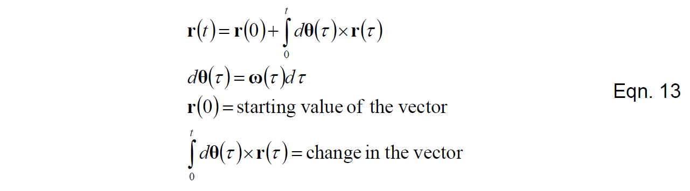
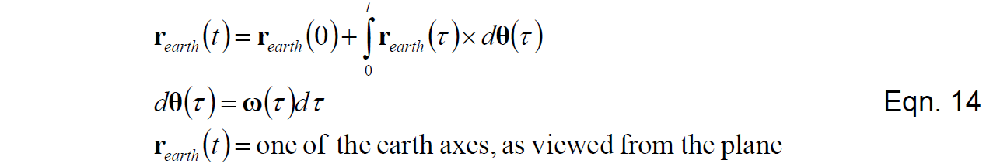
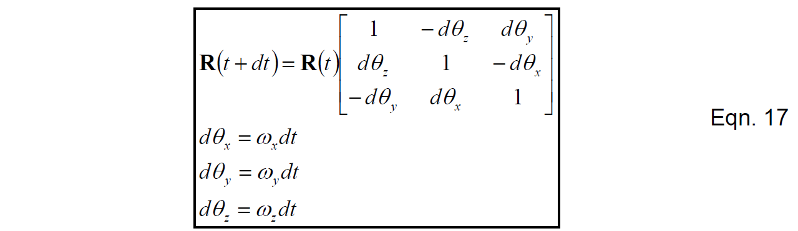

# 陀螺仪信号计算方向余弦

在前文基础上，我们现在关注DCM算法的核心概念：描述陀螺信号和方向余弦矩阵时间变化率之间关系的非线性微分方程。我们的目的是，在不采用任何可能破坏方程非线性的近似条件的前提下来计算方向余弦矩阵。为方便讨论，暂时假设陀螺信号没有任何误差，随后我们将会专门讨论陀螺误差。

与物理陀螺固定在惯性空间而飞行器围绕它旋转不同，电子陀螺随着飞行器一起旋转，产生正比于旋转角速度的电信号。因为旋转的不可交换，所以旋转顺序变得尤为重要，我们不能简单地积分角速度信息来得到角度信息。我们所要做的是从旋转的运动学方程入手，考虑需要做什么才能得到正确的角度信息。

众所周知，旋转运动学方程（由旋转带来的向量的变化率）可以表示为：

观察上式，可以看到：

1. 微分方程是非线性的。输入的角速度向量和我们想要积分得到的方向向量叉乘。因此，任何线性的方法都只是近似结果。
2. 式中所有的向量都在同一参考系下测量。
3. 因为叉乘是不可交换的，所以我们在交换顺序的同时需要改变符号才能保证结果不变。

如果我们知道初始条件和每一时刻的旋转角速度，那么我们可以通过对式(11)进行数值积分得到每一时刻向量的方向。

我们的策略是将R矩阵中的每行或每列视为一个方向向量，采用式(13)积分它们。

采用上述方法所遇到的第一个障碍是：我们想要积分得到的旋转向量和旋转角速度向量不在同一个参考系下测量。理论上，我们想要知道机体参考系在地球参考系下的方向，但是陀螺测量的是机体参考系下的角速度。有一个简单的解决方法是考虑旋转的对称性，即从机体参考系看地球参考系的旋转和从地球参考系看机体参考系的旋转是一致的，只不过方向相反。所以我们可以转而讨论地球参考系在机体参考系下的朝向，这样做仅仅需要将陀螺信号反向即可，但是出于方便考虑，我们利用叉乘的特性，保持陀螺信号符号不变同时改变叉乘顺序。

式(14)中的向量即为式(1)中R矩阵的行向量。接下来的问题是如何方便地应用式(14)。我们使用与Mahony相同的矩阵方法，从式(14)所表达的差分形式着手：

在此之前还需要做的一件事是陀螺漂移的消除，我们需要在陀螺测量角速度的基础上加上角速度修正量来得到我们对角速度的最好的估计。角速度修正量由陀螺漂移反馈补偿器得到，具体的内容将在之后的章节讨论。基本的思路是通过GPS以及加速度参考向量计算旋转误差，然后将之送入反馈补偿器，最后将补偿器输出通过式(16)送回旋转更新方程。

对地球参考系的三个轴做式(14)的同样操作，可以将其写成更为方便的矩阵形式：

式(17)描述了由陀螺信号更新方向余弦矩阵的方法，这与Mahony的结果是相同的。式(17)中的矩阵对角线元素1代表式(15)中的第一项；非对角元素中的那些小量代表式(15)中的第二项。在很短的时间步长内通过不断地矩阵相乘式(17)，每次矩阵乘法需要进行27次乘法和18次加法，对于具有硬件资源来更有效率地进行矩阵乘法的dsPIC30F4011，这种算法表现地很出色。当然，这种算法也可以在不支持矩阵运算的CPU上执行，在这种情况下，推荐使用整数算法。

式(17)采用的唯一近似要求时间步长需要足够的短，这样R矩阵在两步之间不会变化的特别多。一个典型的时间步长是0.02s，角速度大约60度/秒的飞行器在每个步长内大概旋转了0.02弧度，此种情况下R矩阵中元素最大变化率不会超过2%。因此，被忽略的二阶项大概是0.02%。

测试和仿真结果表明，仅仅是应用式(15)，不需要特别好的陀螺，就能得到非常精确的结果：漂移量非常小，大概每分钟几度。对于非常小的漂移，调整它而不损失性能是很容易做到的。然而，式(15)自身运算将会累计数值截断误差，陀螺漂移误差，陀螺偏置误差以及增益误差。在接下来的两章我们将会讨论如何消除这些误差。
