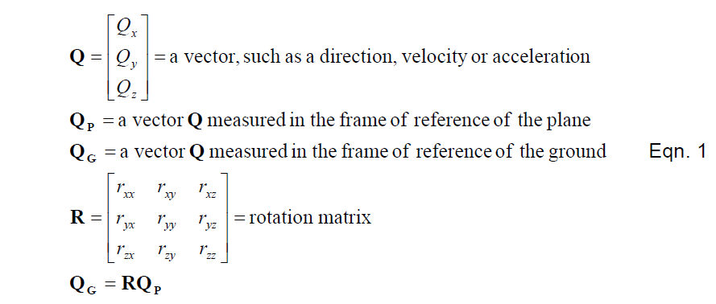
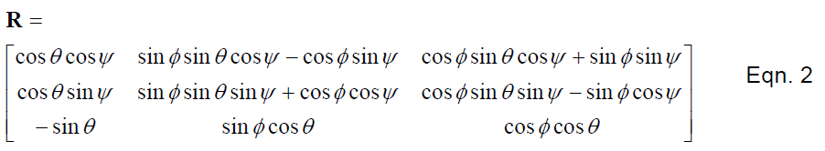
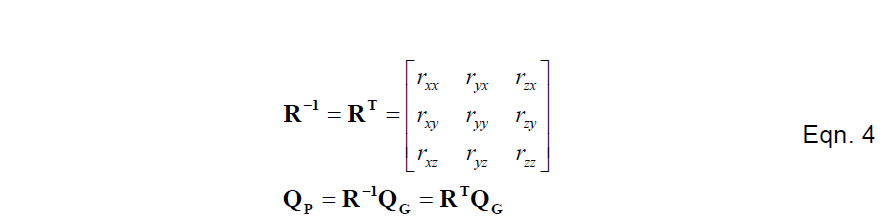
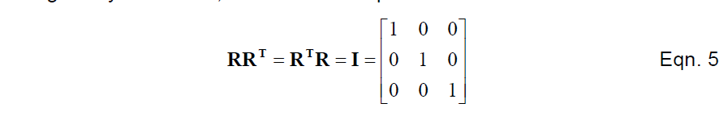
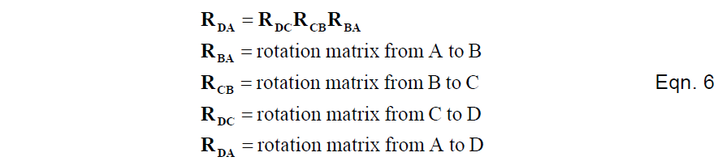
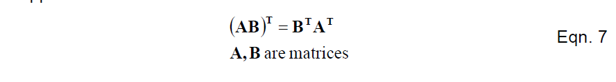

# 方向余弦矩阵
某些类型的向量，比如：方向，速度，加速度，位移，（运动）可以通过旋转参考系和3*3的矩阵来进行转换。通过机体坐标系和地球坐标系，在方向余弦矩阵里对旋转向量进行相乘从而将这些向量进行转换。

方向余弦矩阵和欧拉角之间的关系是：

方程1和方程2表达了怎样把机体参考系里的标准向量旋转（转换？）到地球参考系。方程1可由方向余弦确定，方程2可由欧拉角确定。    

在方程1中，地球坐标系中的每个向量的分量与相应的旋转向量的行和机体坐标系的向量的点积相等。计算旋转需要九次相乘六次相加。方程3通过对向量和矩阵的扩展相乘来对方程1进行复述。    

注意矩阵R并不一定是对称的。矩阵R的三列是用来将机体的三个向量转换到地球参考系。矩阵R的三行是用来将地球坐标系的三个向量转换到机体参考系。矩阵R包含的所有信息都需要表达出机体相对于地面的方向。矩阵R也叫作方向余弦矩阵，因为每一个条目都是机体轴和地球坐标系的轴的夹角的余弦。虽然九个独立参数会在矩阵R中出现，实际上只有三个参数是真正独立的，因为六个所谓正交（也称规范化）的条件是：三个纵列上的向量是互相垂直的，而三个横向的向量等于1。

任何矩阵，特别是旋转矩阵的变换，都可表示为RT，通过互换行和列来完成。通常情况下，如果存在，一个方矩阵的逆可以表示为R-1。矩阵的逆与矩阵相乘等于单位矩阵。单位矩阵的对角线上的值都是1，其他全部为0。任意矩阵乘以单位矩阵都保持不变。在旋转矩阵情况下，对R矩阵的转换等于它的逆矩阵。

旋转矩阵的逆矩阵和它的转置之后相等是因为其结构对称。旋转矩阵的元素是机体参考系和地球参考系各轴夹角的余弦。矩阵的逆变换就相当于互换了地球参考系与机体参考系的角色，与交换矩阵的行和列是一样的，与对矩阵进行转置也是一样的。   

不仅如此，事实上逆和转置相等是和正交性条件一致的，它可以用矩阵符号表示如下：

方程5可以用来证明R矩阵的逆就是R矩阵的转置，通过方式与R的逆矩阵相乘，或者R转置之后的逆。   

旋转矩阵非常有用的一个特点就是：我们可以调整旋转。我们可以将多个旋转矩阵一起相乘，并计算出一个旋转矩阵，相当于把许多的旋转连续起来。在我们已经有的左侧，我们必须小心应用连续旋转。比如我们有三个旋转矩阵：从方位A到方位B，从B到C，从C到D，我们可以通过下面的方程计算出从A到D的旋转矩阵

而当对旋转矩阵进行相乘时，我们需要对这一系列操作非常小心的原因是：矩阵的相乘时不可互换的（互换位置）。也就是说矩阵相乘的顺序异常重要。对于旋转也是这样，不可互换。例如，当机体的俯仰和滚转角都为90度时。顺序非常重要。假设俯仰到90度，接着横滚也为90度，机体将与地面垂直（头朝上垂直）。反之，如果先横滚90度，后俯仰90度，机体为侧躺在地面之上。    

最后，对于一般矩阵，特别是旋转矩阵，还有一个非常有用的特性：两个矩阵乘积的转置等于两个矩阵转置的乘积（对A和B转置之后的位置互换）

