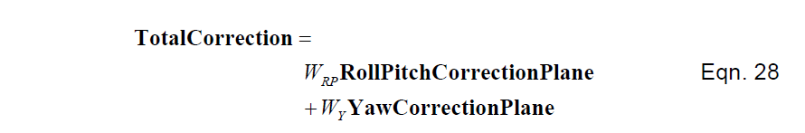
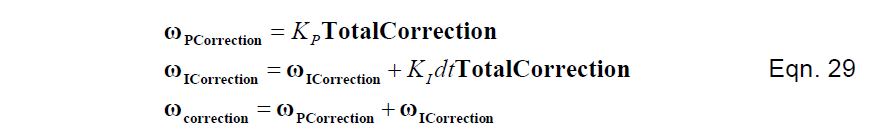

# 反馈控制器
每一个旋转漂移矫正矢量（偏航、滚转和俯仰）乘以重量，输入到比例积分反馈控制器，增加陀螺仪矢量以产生一个矫正的陀螺仪矢量用作方程17的输入。（现在可以回到图1了。）计算过程如下。首先我们计算总共的旋转修正的平均加权。在我们的案例中，有两个修正，但是通常会更多：

接下来，我们把总的修正传输到比例积分控制器：

然后我们把陀螺仪修正矢量以通过给陀螺信号增加修正矢量的方式反馈到旋转更新方程，如方程16所示。    

就此，要通过一个完整的计算来完成。下一步我们重复这整个计算。    

一些读者可能不知道为什么我们使用一个单一的反馈控制器的加权输入，而不是每一个向量一个单独的控制器。其实，我们可以这样，但长时间单独的积分器将积累等值反向的误差，最终可能导致积分器饱和或翻转。测试表明，这种情况的发生将需要很长的时间。然而，使用一个单独的控制器结果会更加正确。    

权重和增益的选择需要在准确性和从干扰中恢复的速度方面进行折衷。使用重量和收益，有足够大的恢复在约10秒的风力和陀螺仪的实际情况。在风和陀螺仪饱和的实际情况下，用权重和增益比较好，最多10秒钟就可以恢复。在反馈环里，DCM算法是一种非线性积分器。因此，你可以为整个环选择线性化等效的动态模型的增益。    
