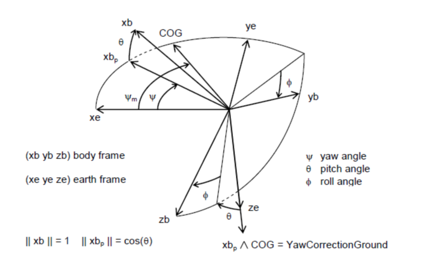

# GPS
GPS提供无漂移时飞机偏航指向的参考矢量。我们不使用GPS本身来得到偏航信息的唯一理由是陀螺的瞬态响应比GPS快多了。相反，我们使用GPS作为参考矢量来消除陀螺漂移并获得航向“锁定”。   

GPS无线电模块提供的两个主要服务是汇报位置和速度的大小与方向。GPS根据它从在轨卫星收到的信号决定它的位置和速度，并且通过串口发送出信息。对于大部分GPS接收机，都有两种数据格式，NMEA和二进制。NMEA是用逗号分隔、可以直接阅读的标准ASCII码格式。在二进制接口中，二进制值以其内部含义代表的二进制的1和0组成的序列发送。二进制接口提供了一些NMEA接口不能获得的额外信息。   

为了给出方向信息，GPS必须要移动。否则就确定不了GPS天线的指向。GPS报告的速度矢量是天线在1秒内的位置变化量。有一些GPS或许可以用来计算方向的方法，但对于所有方法，GPS都必须要移动。   

对于GPS模组有两种不同的坐标系来报告位置和速度。一个坐标系报告、经度、纬度、距地面高度偏航角（偏航角是测量出的航线偏离北方的顺时针角度）。相当有趣的是，从数学意义上，当机体固连参考系的Z轴指向正下方时，这个偏航角和绕该轴顺时针旋转测量得到的角是同一个角。在该参考系中，竖直速度可以通过二进制接口获得。   

另一参考系，ECEF（(earth-centered, earth-fixed）报告XYZ方向上的位置和速度，该参考系是原点在地心的右手XYZ坐标系。
GPS以报告的连续序列发送其信息，通常是每秒一次（1HZ）。虽然有提高报告频率到更为普遍的每秒5次（5HZ）的趋势，但更高的报告频率并不一定带来更好的性能，因为GPS内部信号处理的动力学产生了限制。   

在考虑GPS动力学时，应该留心以下几种因素：

1. 报告延迟。在某些环境下，对于一些GPS模组，发送计算数据会花费长达12秒的时间；
2. 滤波。所有的GPS模组都进行了某类滤波来提高位置和速度的精度。当GPS改变速度或位置时，这种滤波会对位置和速度的估计产生平滑作用，以至于新的信息不会立刻被看到，但会逐渐显露出来。
3. 跟踪平滑和静态导航。很多种GPS无线电模块提供“跟踪平滑”选项以便忽略位置或速度的急速改变。为了防止卫星信号的变化被当成结果的变化，例如当正在使用的卫星集合改变了，这个功能对于汽车应用是有用的。GPS无线电模块也提供了“静态导航”选项，以便当速度落于一定值之下时，明显的位置变动被压制住。这对于汽车应用也是有用的。

你不可能每个模块都使用了跟踪平滑或静态导航功能，因为厂家会默认关闭这些选项，但你应该意识到它们。可是，报告延迟和滤波一定要考虑。   

报告延迟意味着GPS测量到位置和速度的时刻和消息序列出现时刻的一个简单的时间延迟。通常这个延迟是报告的时间周期。例如，如果你的GPS是以5HZ报告，报告延迟通常是0.2秒。但是，如果你不仔细的话，延迟也会大的多。我们中的一位（Bill）曾经不幸在1Hz的报告频率下遭遇到12秒的延迟。最终证明12秒的延迟是由于同时使用了4900的波特率和二进制接口。改变波特率到19200，延迟减小到1秒。幸运的是你不会经常碰到这个效果，但要意识到它存在。如果你使用二进制接口，你应该使用19200或更高的波特率。   

除了简单的延迟，你通常也会遇到由GPS内部滤波造成的延迟。由于GPS模组本身计算的本质所致，它们都进行了某种方式的数据滤波。对于任意系统在精度和瞬态响应之间本质上都有折中。你想知道某些事情越准确，估计它花的时间越长。在大部分模组中，滤波体现为对数据的平滑。通常，很多种GPS的动态响应是带有1秒时间常数的简单的指数响应，以至于要花费整整大约3秒来响应阶跃变化。如果你忽视了GPS的动力学，在转弯时将会有微小误差引入到你的导航解算中。我们中的一位（Paul）看到在方向余弦阵和偏航漂移修正的输入中引入滤波器有可能补偿微小误差。[我们需要一张图吗？]那样的话，两个用于估计偏航角误差的矢量动力学就匹配了。   

经常假设有很高报告频率（例如5HZ）的GPS，将会比报告频率为1HZ的GPS提供更好的动态性能。但是，又没有确凿的案例证明更高的报告频率提供更好的动态响应。当然，它的延迟也会变小。但是，滤波器动力学仍旧存在问题，通常证明效果很有限。   

对地航向的水平GPS分量经过长时间后会有零点漂移，而且这个水平过程可以用作参考矢量来获得对惯性测量单元的“偏航锁定”。我们也考虑包含GPS的垂直速度，但终究决定排除了它，而更倾向于加速度计来提供垂直信息。    

假设飞机在指向的方向上运动。任何假设中的瞬态误差本质上都不会影响性能。但是，大风，特别是侧风会违背这个假设。你可以采用两种方法。一种方法是以某种方式从获得的信息中计算风矢量。我们一直致力于这个工作。另一种方法是使用适量的反馈增益。飞机的指向和运动方向的差别会以误差的形式输入到漂移修正反馈控制器中。结果是方向余弦阵会适应风，并把飞机旋转一定角度以保持飞机沿着地面系的目标航线运动。    

下面的图片展示了偏航修正是如何计算的：   

对地GPS航向矢量和IMU滚转轴（X）在水平面上的投影意味着漂移量。旋转修正是R矩阵X列和对地航向矢量叉积的Z分量。    
首先，我们从规范化的水平速度矢量构建参考矢量。可以通过简单地用地球参考系的对地航向角的余弦和正弦来做

接着我们计算偏航修正

但是，方程23得出的是地球参考系中的偏航角修正。为了调整陀螺漂移，我们将需要知道机体系中的修正矢量。为了计算这个，我们必须对地面系中的偏航修正乘以R矩阵的Z行

方程24产生的偏航修正矢量将和从加速度计算得到的滚转-俯仰修正结合为整个的一个矢量用来补偿漂移。计算的细节将在我们讨论完加速度计如何使用后给出。    

有三种相对于偏航补偿的情形支持大的偏航修正权重，使得快速响应偏航误差。    

第一种情形是初始偏航锁定。当算法开始后，根本没办法知道板子的指向，即便知道，经过一段等待GPS锁定的时间，航向也一直在漂移。而且就算GPS锁定后，在飞机起飞前，GPS报告的对地航向也会是随机数。通过给偏航漂移修正一个大的权重，偏航锁定可以在起飞后立刻获得。    

第二种情形是风。如果飞机在侧风中飞了很长时间，风会被当成陀螺补偿。如果飞机接着转弯180度，经过一段时间方向余弦阵算法会转动飞机到反向的角度，这个角度需要补偿风。    

第三种情形是当飞机垂直运动时，飞机的X轴是垂直的，方程23为0。     

出于这些原因，最好使用大的偏航漂移修正权重。    

