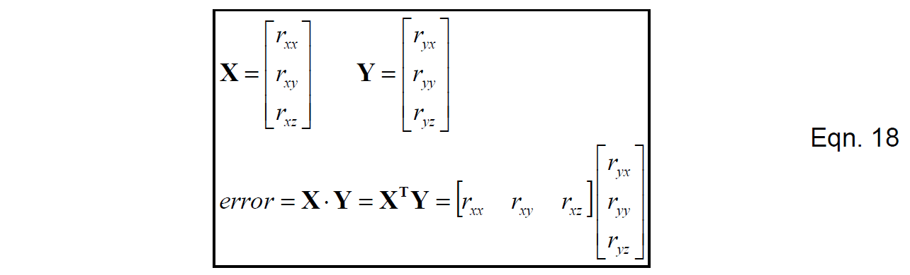
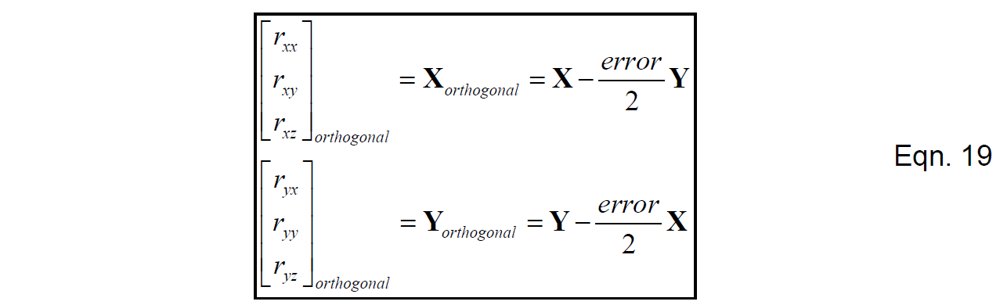
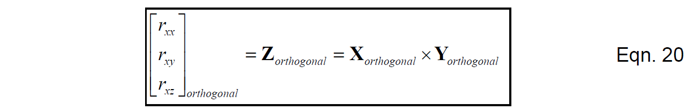
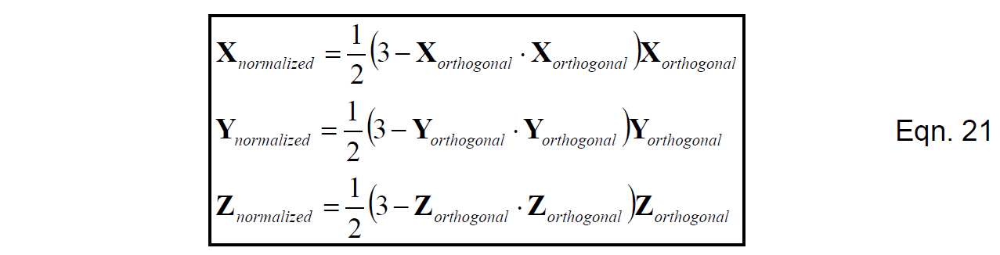

# 重规范化

由于数值误差的存在，方向余弦矩阵不再满足正交性，即式(5)右端不再严格等于单位矩阵。事实上，此时坐标系不再描述一个刚体。幸运的是，数值误差积累地非常缓慢，所以及时修正误差不是一件困难的事情。

我们把使方向余弦矩阵满足正交性的操作称为重规范化。有很多种方法可以实现重规范化操作。仿真结果显示它们的效果都比较好，这里给出最简单的一种方法，操作流程如下：

首先计算方向余弦矩阵X轴与Y轴的内积，如果矩阵严格正交，那么这个结果应该是0，所以这个结果实际上反映了X轴与Y轴相互旋转靠近的程度。

把误差均分给X轴与Y轴，并近似地将X轴与Y轴分别向相反的方向转动，在此X轴与Y轴互相修正，具体操作如下：

可以验证，将式(19)代入式(18)后，正交性误差逐渐减小。验证过程中可能需要用到方向余弦矩阵行列均为单位向量这一条件。相比于将误差完全分给X轴或Y轴其中一个，将误差均为能够在修正后得到更小的误差。

下一步是调整方向余弦矩阵的Z轴，使得它与X轴和Y轴均正交。这里我们采用的方法是简单地重新计算Z轴，使其等于X轴与Y轴的外积。

最后一步是调整方向余弦矩阵每一行的大小使其等于1。一种方法是对每一行的每个元素，除以该行元素平方和的二次方根。然而，有一种更容易的方法是，鉴于每一行的大小不会与1相差太远，可以采用泰勒展开。计算方法如下所示：

式(21)所描述的是将每行向量归一化的操作：用3减去该行向量与自身的内积（该行元素平方和），然后乘以1/2，最后将结果乘到该行所有元素上。
 
采用此种方法进行归一化的好处是，既没有采用更多的乘法和加法，同时也完全移除了除法与平方根运算。在每一步积分都执行上述重规范化操作，执行周期为0.02s。